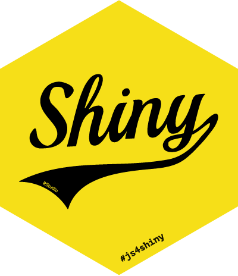

JavaScript for Shiny Users — Outline
================
Garrick Aden-Buie

This repository contains the workshop slides for the **JavaScript for
Shiny** workshop at `rstudio::conf(2020)`.

-----

## Most Important Skills

1.  Find things with CSS selectors

2.  React to browser events

3.  Modify & define appearance

4.  Create new components with HTML, CSS & JS

5.  Use external libraries

6.  Use R tooling for HTML in R (`htmltools`, `htmlwidgets`)

7.  How to communicate between Shiny server and client (browser)

8.  Use Bootstrap

-----

## Monday Morning — 9:00 - 10:30

### [Welcome](slides/00-hello.html) (15)

  - Meet your neighbors
  - Are we ready?
  - Workshop announcements, etc.
  - Make a folder for the things we create

### [Hello WWW](slides/01-intro.html) (15)

  - How does the web work?
  - HTML + CSS + JS a first example
  - What can we do with JS + Shiny?
  - Workshop Goals

### Maiden Voyage: [How to build a website](slides/02-how-to-build-a-website.Rmd) (60)

#### Key Points

1.  Overview of web development
2.  The role of each language
3.  Where to put HTML, CSS, JS
4.  HTML 101
5.  Basic CSS and JavaScript

#### Outline

  - Web Dev and where R Markdown and Shiny fit in
  - Anatomy of an HTML document
      - There is a `<head>`, `<body>`
      - Create a page (`first-page/index.html`)
      - **TASK** Add content to page (2)
  - About HTML tags
      - Open Dev Tools
      - HTML tree: Element, node, DOM
      - HTML Tags:
          - Have open and close
          - Must be nested
          - Are block or inline
      - Block vs Inline
          - Document flow
          - Have width/height
          - div vs span
      - Common HTML Elements
          - **TASK** block or inline? (4)
          - How to find elements in Inspector
          - Common elements table
              - Try to use *semantic* elements as much as possible
              - How to search MDN
  - Classes, IDs and Attributes
      - Notice class, id, etc. in Yihui’s page
      - Tags have attributes, e.g. `<a>`
      - All tags can have a `class`, an `id`, and/or `style`
          - `id`: unique identifier
          - `class`: this kind of thing
          - `style`: make this one thing look like this (use as a last
            resort)
          - `id` and `class` are useful when trying to *find* or *change
            appearance* of an element.
      - Examples
          - `<header class="title">`
          - `<h2 id="how-to-work-with-mathjax">`
          - `
`
      - **TASK** update our page
          - What parts of the page should change?
          - What parts of the page should get special treatment?
          - Add placeholder for plot
  - Cascading Style Sheets
      - What and where?
      - Inside `<style>` tag in index.html
          - Set header & strong colors
          - Set background colors for target elements
              - `#` for Ids, `.class` for class
              - Use `.city` and `.age` class
          - Give chart placeholder a size
          - Set base font <https://systemfontstack.com/>
          - CSS variables
      - Refactor code:
          - Unique ID for each city name
  - JavaScript
      - Intro to the dev console (JS bare minimum)
          - Numbers, strings, boolean
          - Addition, subtraction, division, etc.
          - `console.log()`
      - Document methods
          - Methods are functions that are attached to objects
          - The browser gives us `document`, which has
              - `document.getElementById('age')`
              - `document.querySelector('#city-header')`
          - Change age using `.textContent`
          - Change city name using `.innerHTML`
          - Changing the HTML rewrites the HTML in the browser
      - Assignment with `=`
      - Put JS in `<script>` tag at bottom of page
          - What happens if you put it at the top?
          - **TASK** Change to Los Angeles (35.9)
  - How to do this using R Markdown
      - *time permitting*
      - Rewrite our first page in Rmd by moving relevant sections to
        `js`, `css` chunks
      - `js4shiny::html_document_plain()`
      - vs `rmarkdown::html_document()`

## Monday Morning — 11:00 - 12:30

### Interacting with the Browser (Ghost in the Machine, 45)

#### Key Points

1.  JavaScript Arrays and Objects
2.  Function Basics
3.  Browser events
4.  How to import external JavaScript libraries

#### Activities

  - Add our own cities data
  - Add our data in a separate `<script>` tag as JSON and parse it
  - Use two buttons to switch between Los Angeles and San Francisco
  - Add a select input and update city on change
  - Use the Frappe Charts `data-select` event to update the text

#### Outline

  - Objects

  - Arrays

  - Prototypes & Inheritance

  - Functions

  - Browser Events

  - Button

  - JSON

  - Use external libraries
    
      - CSS
          - `<link rel="stylesheet" type="href">`
          - move styles to `styles.css`
          - replace with [water.css
            (dark)](https://cdn.jsdelivr.net/gh/kognise/water.css@latest/dist/dark.min.css)
      - JS
          - move our script to `script.js`
          - where to put it
              - in `<head>` (ext. libraries)
              - at end of `<body>`

  - Bring in [Frappe Charts](https://frappe.io/charts)
    
      - JS lib documentation typically shows:
          - Script tag to bring in external resource

### Look Sharp\! (45)

#### Key Points

1.  CSS Selectors in depth
2.  CSS Box model and positioning
3.  CSS properties and units
4.  Boostrap and `@media`

#### Outline

1.  Review block vs inline
2.  Display: block, inline, none
3.  Box sizing
4.  border, margin, padding
5.  CSS Selectors
    1.  Combining selectors
    2.  beyond element, class, id
6.  CSS Cascade
    1.  importance
    2.  origin
    3.  specificity
    4.  position
7.  CSS Aim Game

## Monday Afternoon — 13:30 - 15:00 (Ok Computer)

#### Key Points

1.  If/else
2.  JavaScript For Loops
3.  JavaScript Functions (and callbacks)
4.  JavaScript Array and String Methods
5.  Manipulating the DOM
      - Pass by reference vs value
6.  HTML `data` attributes

#### Activities

1.  Recreate `seq()` and `seq_along()`
2.  Use `Math.random()` to re-create `runif()` in JavaScript
3.  Add `#` next to headers from R Markdown

#### Learning Topics

  - if/else
  - truthy/falsy
  - strict equality
  - ternary ifelse
  - string addition for concatenation
  - template strings
  - `for...of` for arrays
  - `for`
  - looping over objects
  - function definitions
  - arrow functions
  - scope wrt functions
  - array.forEach
  - array.map
  - array.filter
  - array.reduce
  - functions on objects?

## Monday Afternoon — 15:30 - 17:00

#### Key Points

1.  Writing web documents with `htmltools`
2.  Managing dependencies with `htmltools::htmlDependency()`
3.  Using `npm`

## Tuesday Morning - 9:00 - 10:30

### Key Points

1.  Wake up and review (15 minutes)
2.  Build an htmlwidget (prototype to MVP that works in Shiny)

## Tuesday Morning - 11:00 - 12:30

## Key Points

1.  Communicating With Shiny
      - How to get JavaScript and CSS into Shiny
      - Shiny events
      - Sending messages back and forth

## Outline

1.  How to include HTML, CSS, JS in Shiny (overview) - Ex: Compare notes
    on preferences of each method
2.  jQuery Crash Course - Note: no exercises
3.  Shiny Events - `shiny-events-1` … `shiny-events-4` - can be done as
    exercises or as live demo
4.  Calling Shiny (sending data in Shiny) - `shiny-setInputValue` - back
    to frappeCharts

## Tuesday Afternoon — 13:30 - 15:00

1.  Overview of Shiny inputs
2.  Follow [shiny input dev
    journal](https://github.com/gadenbuie/js4shiny-frappeCharts/tree/shiny-input/inst/shiny-input-app#readme)
    (Mainly use this as slides)
3.  [Slides about debouncing](extending.html#debounce)

Need slides for debounce, throttle, direct…

<!-- Notes --

* More Songs About Buildings and Food (Talking Heads)
* Transmissions From the Satellite Heart (The Flaming Lips)
* And then Nothing Turned Itself Inside-Out (Yo La Tengo)
* Things Fall Apart (The Roots)
* How Strange, Innocence (Explosions in the Sky)
* August and Everything After
* Look Sharp! (Joe Jackson)
* Licensed to Ill (Beastie Boys)
* OK Computer (Radiohead)
* Master of Puppets (Metallica)
* Pleased to Meet Me (Sire)
* Bringing it all back home (Dylan)
* Raw Power (Iggy and the Stooges)
* The Blueprint (JZ)
* Mothership Connection (Parliament)
* Ghost in the Machine (The Police)
-->
